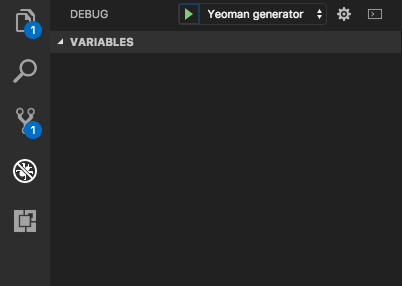

# Yeoman generator for you Kubernetes boilerplate code

[](https://travis-ci.org/sesispla/generator-kubegen)
[](https://coveralls.io/github/sesispla/generator-kubegen)

[](https://www.npmjs.com/package/generator-kubegen)

kubegen is a tool that aims to simplify your Kubernetes day-to-day, writing the boilerplate code for you and letting you focus on the important things.

kubegen is a [Yeoman](http://yeoman.io) generator, so you'll need to have [NodeJS](https://nodejs.org/) installed.

# Installation

To install kubegen, you need to execute the following command:

```bash
npm install generator-kubegen
```

# Usage

Quite easy! The follwing commands are available at the moment:

| Command                | Description                                                                                                | Arguments                                                                |
| ---------------------- | ---------------------------------------------------------------------------------------------------------- | ------------------------------------------------------------------------ |
| yo kubegen             | Starts a full Kubernetes file generation wizard. All generated files are stored in a new folder.           | --apply: Spawns a "kubectl apply -f " to all files generated immediately |
| yo kubegen:deployment  | Starts the Deployment subgenerator. 'deployment.yml' file is created, in the current folder.               |                                                                          |
| yo kubegen:rc          | Starts the Replication Controller subgenerator. 'rc.yml' file is created, in the current folder.           |                                                                          |
| yo kubegen:service     | Starts the Service subgenerator. 'service.yml' file is created, in the current folder.                     |                                                                          |
| yo kubegen:ingress     | Starts the Replication Controller subgenerator. 'deployment.yml' file is created, in the current folder.   |                                                                          |

```bash
yo kubegen

 |  |/  / |  |  |  | |   _  \  |   ____| /  _____||   ____||  \ |  |
 |  '  /  |  |  |  | |  |_)  | |  |__   |  |  __  |  |__   |   \|  |
 |    <   |  |  |  | |   _  <  |   __|  |  | |_ | |   __|  |  . `  |
 |  .  \  |  `--'  | |  |_)  | |  |____ |  |__| | |  |____ |  |\   |
 |__|\__\  \______/  |______/  |_______| \______| |_______||__| \__|

Welcome to Kubernetes Generator (kubegen)!
? How the service should be named? nginx
? In which Namespace should be deployed? default
? Which type of Pod controller mechanism whould you like to use? Deployment
? (Deployment) Which Docker image should the Deployment use? nginx
? (Deployment) How much container replicas should be created? 1
? (Service) In which port is the Container listening? 80
? (Service) In which port should the Service listen? 80
? (Ingress) Would like to expose the service out of the cluster? yes
? (Ingress) Does the service have a hostname? nginx.sesispla.net
? (Ingress) Ingress root path? /
? (Ingress) In which port should the Ingress listen? 80
   create deployment.yml
   create svc.yml
   create ing.yml
```

# Contributing

Contribution is welcome! Just:

- Fork this project
- install the NPM dependencies:

```bash
npm install
```

- Link this folder to npm

```bash
npm link
/usr/local/lib/node_modules/generator-kubegen -> /Users/User/generator-kubegen
```

- Edit the project with your favorite text editor or tool

# Debugging

For your conveniente, this project comes with a pre-built configuration to debug the solution with [Visual Studio Code](https://code.visualstudio.com). Just go to the "Debug" menu on the left, select "Yeoman generator" in the dropdown (beside "play button") and then click "play" to start debugging.

